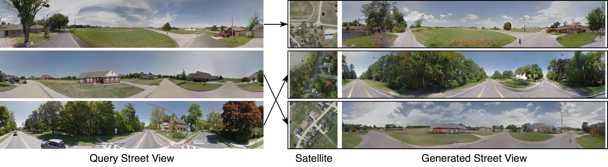

<h1> Coming Down to Earth: Satellite-to-Street View Synthesis for Geo-Localization </h1>

Implementation of the CVPR 2021 paper <a href="https://arxiv.org/pdf/2103.06818.pdf">Coming Down to Earth: Satellite-to-Street View Synthesis for Geo-Localization</a>. 
<h3> Dependencies </h3>
The code has been implemented & tested with Python 3.6.9 and Pytorch 1.5.0.
<h3> Usage </h3>
<h4> Datasets </h4>

 For CVUSA dataset: Use <a href="https://github.com/viibridges/crossnet">page</a>.

 For CVACT dataset: Use <a href="https://github.com/Liumouliu/OriCNN">page</a>.

